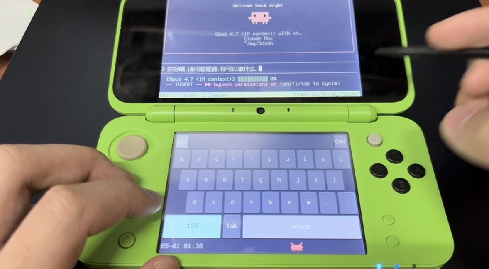

<p align="center">
  <b>English</b> · <a href="README.zh.md">中文</a>
</p>

<h1 align="center">DSSH</h1>

<p align="center">
  
</p>

<p align="center">
  <b>Nintendo 3DS SSH client — pinyin IME · voice input · ANSI terminal</b><br>
  Top screen runs a citro2d ANSI terminal · bottom screen draws its own
  soft keyboard · RSA public-key auth over libssh2 + mbedTLS<br>
  Press <b>START</b> to dictate Chinese into Claude Code; type pinyin on
  the soft keyboard for the rest.<br>
  Run <code>tmux</code> + <code>claude-code</code> from a 3DS — code from
  the couch without ever opening the laptop.
</p>

<p align="center">
  
  
  
</p>

<p align="center">
  <br>
  <sub>Real New 2DS XL · top screen ANSI terminal · bottom screen soft
  keyboard + clock + crab</sub>
</p>

<p align="center">
  <a href="https://github.com/Fishason/DSSH/releases/latest/download/demo.mp4">
    Full 1m42s demo video (10 MB MP4)
  </a>
</p>

<p align="center">
  <br>
  <sub>Real New 2DS XL · top: typing「你好啊！请问您是谁，你可以做什么」into
  Claude Code · bottom: letter page + CHN mode + Shift held</sub>
</p>

---

## Features

- **Full ANSI / VT100 terminal** — tmux status bar, claude-code spinner,
  box-drawing borders, 256-color, TrueColor, Braille; everything renders.
- **Chinese rendering** — bundled Zpix 12px pixel font covers 21,000+ CJK
  unified ideographs, Terminus 6×12 for ASCII; mixed CJK/ASCII baselines
  align cleanly on the same line.
- **Self-drawn soft keyboard** — iOS-style 3px rounded keys with smooth
  press-down animation; letters / symbols pages.
- **Pinyin input method** — top 300k entries from rime-ice, plus
  abbreviation matching (`nh` → 你好), prefix fallback (`nihaoz`
  auto-falls-back to `nihao`), and a candidate cursor.
- **Voice input (NEW in v1.0)** — press **START**, speak a Chinese
  sentence, press **START** again; ~1-2 s later the transcribed text
  drops straight into the SSH terminal.  Default backend is OpenRouter
  Whisper Large V3 Turbo over the cloud (`$0.04` per audio-hour); a
  self-hosted whisper.cpp track is available if you'd rather not depend
  on an external API.
- **RSA-4096 public-key auth** — libssh2 + mbedTLS, private key read
  from the SD card.
- **Full physical-key mapping** — D-pad arrow keys, hold-style modifiers
  (L = Shift, Y = Ctrl, X = Alt), Circle Pad scrollback / mouse-wheel.
- **Anthropic-red crab mascot** — scampers along the bottom row, dodges
  when you tap it 🦀.
- **Hidden debug page** — double-tap the ENG/CHN badge to see the live
  SSH byte stream, full key-binding cheat sheet, and a mascot toggle.

## Table of contents

- [Install](#install)
- [Server-side setup](#server-side-setup-one-time)
- [Configure config.ini](#configure-configini)
- [Voice input](#voice-input)
- [Key bindings](#key-bindings)
- [Using the IME](#using-the-ime)
- [Debug page](#debug-page)
- [Build from source](#build-from-source)
- [Project layout](#project-layout)
- [Credits](#credits)
- [License](#license)

---

## Install

DSSH runs on a **modded 3DS / 2DS / New 3DS**.  You need either the
Homebrew Launcher (HBL) or a CIA installer like FBI.

### Option A — `.cia` install (recommended)

1. Grab `DSSH.cia` (~14 MB) from the [latest release](../../releases/latest).
2. Copy it anywhere on the SD card (e.g. `/cias/DSSH.cia`).
3. Open FBI → SD → select `DSSH.cia` → `Install CIA`.
4. The orange DSSH icon shows up on the HOME menu.

### Option B — `.3dsx` direct launch

1. Grab `3dssh.3dsx` from the latest release.
2. Copy to `/3ds/dssh/dssh.3dsx` on the SD card.
3. Open HBL → pick DSSH.

### Option C — `3dslink` over Wi-Fi (developer flow)

```bash
# On the 3DS: launch HBL, press Y → "Waiting for 3dslink..."
3dslink -a <3DS-LAN-IP> 3dssh.3dsx
```

---

## Server-side setup (one-time)

The 3DS libssh2 build uses mbedTLS as its crypto backend and
**hardcodes-disables ed25519**.  So you generate a fresh RSA-4096
keypair just for the 3DS — your existing ed25519 key on the PC keeps
working untouched:

```bash
# 1. Generate a 3DS-only RSA key on your PC
ssh-keygen -t rsa -b 4096 -f ~/.ssh/id_rsa_3ds -C "3ds-ssh-client"

# 2. Copy the public half into the server's authorized_keys
ssh-copy-id -i ~/.ssh/id_rsa_3ds.pub user@your-server.example.com

# 3. Verify the new RSA key works from your PC
ssh -i ~/.ssh/id_rsa_3ds user@your-server.example.com 'echo OK'
```

**Recommended hardening**: prepend the new line in the server's
`~/.ssh/authorized_keys` with `from="<your-home-public-IP>"` so a lost
SD card can only log in from your home network.

Copy the **private key** `~/.ssh/id_rsa_3ds` onto the SD card at
`/3ds/3dssh/id_rsa` (the path is fixed even when DSSH is installed as a
.cia — config + key always read from `sdmc:/3ds/3dssh/`).

> ⚠️ The SD card stores the key in plain text.  Anyone holding the SD
> can log in to your server.  Add `from="..."` IP restriction or
> `command="..."` lockdown in `authorized_keys`.

---

## Configure config.ini

Copy `sd_template/3ds/3dssh/config.ini.example` to the SD card at
`/3ds/3dssh/config.ini` and edit the values:

```ini
host       = your-server.example.com
port       = 22
user       = ubuntu
key_path   = sdmc:/3ds/3dssh/id_rsa
passphrase =
```

| Field | Meaning |
|---|---|
| `host` | Server IP or hostname |
| `port` | Port (default 22) |
| `user` | SSH login user |
| `key_path` | Private key path; `sdmc:/...` is the 3DS standard SD prefix |
| `passphrase` | Optional key passphrase; leave empty (typing one on the soft keyboard is awkward) |

Final SD layout:

```
sdmc:/3ds/3dssh/
├── config.ini
└── id_rsa
```

---

## Voice input

> **TL;DR**: install the **API track** (one curl + one API key, ~30 KB
> on disk, ~1-2 s end-to-end).  The self-hosted track exists for
> completeness but is *not recommended* for typical servers — see the
> warning at the bottom of this section.

Press **START** on the 3DS, speak a Chinese sentence, press **START**
again — the transcribed UTF-8 text drops into the SSH terminal as if
you had typed it.  Full sentences flow into Claude Code without ever
opening the soft keyboard.

The 3DS records 16 kHz PCM mono via its built-in microphone, ships up
to 8 seconds of audio over a **second libssh2 channel** on the same
SSH session (no new ports, no new auth, no firewall changes), and a
small server-side shim transcribes via Whisper.

**Status indicator** (top-left of the soft keyboard top row):
- 🔴 **REC** (red, pulsing) — recording in progress
- ⠋⠙⠹⠸ (cyan, spinning) — uploading + transcribing
- **ERR** (red, 2 s) — request failed; press START again to retry

### Recommended install — API track

Get an OpenRouter API key from
[openrouter.ai/settings/keys](https://openrouter.ai/settings/keys)
(typical cost: **$0.04 per audio-hour** ≈ a few cents per month for
ordinary use).  Then on your server:

```bash
git clone https://github.com/Fishason/DSSH.git ~/dssh-repo
bash ~/dssh-repo/tools/install_whisper_api.sh
# ↑ pastes your OpenRouter API key when prompted, or set it via:
#    OPENROUTER_API_KEY="sk-or-v1-..." bash ~/dssh-repo/tools/install_whisper_api.sh
```

Footprint: a 5 KB Python shim + a 3 KB bash CLI wrapper.  No daemon,
no model, nothing to monitor.  Config files:

```
~/.config/dssh-whisper/
├── track       # "api" or "local"
└── api-key     # chmod 0600
~/.local/bin/
├── dssh-whisper          # CLI wrapper
└── dssh-whisper-shim     # the 3DS reaches this over SSH-exec
```

| Field | Value |
|---|---|
| Inference | OpenRouter Whisper Large V3 Turbo (cloud) |
| Latency (4 s clip) | ~1-2 s |
| Cost | $0.04 / audio-hour |
| Server install size | ~30 KB |
| Server CPU load | negligible |
| Internet | required (HTTPS to openrouter.ai) |

That's enough for 99% of users — install it, press START, done.

### `dssh-whisper` CLI

```
dssh-whisper status                # active track + daemon status + key presence
dssh-whisper switch                # toggle api ↔ local
dssh-whisper switch [api|local]    # set explicit track
dssh-whisper start                 # start local daemon (dual install only)
dssh-whisper stop | close          # stop local daemon
dssh-whisper restart
dssh-whisper logs [-f]             # tail systemd-user logs (dual install)
dssh-whisper uninstall             # remove all dssh-whisper files
```

Daemon-related commands degrade gracefully on the API-only install
(they print "no daemon to start", non-fatal).

### Notes

- 3DS firmware caps recording at ~7 s per press (the 256 KB mic buffer
  fills at 16 kHz × 16-bit).  Tap **START** earlier to commit any time.
- Use **HOME** (not START) to exit DSSH — START is dedicated to voice.
- `~/.config/dssh-whisper/` is on `.gitignore` already; rotating the
  API key is one `echo > api-key` away.
- The 3DS code calls `~/.local/bin/dssh-whisper-shim` over a libssh2
  exec channel.  The shim reads the active track and dispatches —
  switching tracks doesn't require restarting the 3DS or the SSH
  session.

### Advanced — Dual track (self-hosted, ⚠️ not recommended)

> ⚠️ **Heads-up**: the self-hosted track loads the `whisper-small`
> model (~1 GB resident) and runs CPU inference for every recording.
> On a 2-vCPU AWS t3.medium with VS Code Remote, claude-code, tmux, and
> chrome-devtools-mcp running, transcribing 4 seconds of audio took
> **~40 seconds** — vs. **~1.5 seconds** through OpenRouter at the same
> moment.  The cost difference is so small ($0.04 per *audio* hour ≈
> pennies/month for personal use) that we strongly recommend the cloud
> path unless you have a hard reason to keep audio on-prem.
>
> If you do go local, plan on:
>
> - **4+ idle vCPU cores** at 3+ GHz — anything less and the 3DS UX
>   spinner becomes painful.
> - **2+ GB free RAM** for the small.zh model + buffers.
> - **No competing CPU consumers** during transcription windows.
> - **~600 MB disk** for the model + venv.

If you genuinely want the offline path, the same `dssh-whisper` CLI
manages both tracks side-by-side — install the dual variant and flip
on demand:

```bash
git clone https://github.com/Fishason/DSSH.git ~/dssh-repo
bash ~/dssh-repo/tools/install_whisper_dual.sh
```

The dual install still defaults to `track=api`; flip to local only when
needed:

```bash
dssh-whisper switch local   # next START press → self-hosted whisper.cpp
dssh-whisper switch api     # next START press → OpenRouter (default)
dssh-whisper switch         # no arg = toggle
```

---

## Key bindings

### Physical buttons

| Button | Function | Notes |
|---|---|---|
| **A** | Enter (EN) / **emit pinyin buffer as English** (IME) | Accidentally typed English in CN mode? Press A and the buffer flies to SSH as raw ASCII — no need to backspace and switch modes. |
| **B** | Backspace / consume one pinyin letter | Hold-style auto-repeat (peaks at 60 / sec) |
| **X** | Alt modifier | Hold-style — held when the next key fires |
| **Y** | Ctrl modifier | Hold-style — Y + tap `c` → Ctrl-C |
| **L** | Shift modifier / **+ Circle Pad → right pane** | See [tmux split scrolling](#tmux-split-scrolling) below |
| **R** | Toggle CN/EN input mode | Top-right ENG/CHN reflects the current mode |
| **SELECT** | Esc | Tap fires immediately |
| **START** | **Voice input toggle** | Press once to start recording; press again to stop and transcribe.  See [Voice input](#voice-input). |
| **Space** (soft keyboard) | Plain space (EN) / **commit highlighted candidate** (IME) | Matches sogou / fcitx convention |
| **Shift + .** | **。** (full-width Chinese period, U+3002) | Works in both EN and CN modes |
| **D-pad ↑↓** | Arrow keys / IME page nav | When the IME buffer is active, ↑↓ paginates candidates |
| **D-pad ←→** | Arrow keys / IME selection cursor | When active, ←→ moves the candidate cursor within the page |
| **Circle Pad ↑↓** | Scrollback / tmux mouse-wheel | Default targets the left/top pane; **hold L → right/bottom pane** |

> Long-press D-pad or B: 250 ms initial delay, ramps up to 12 / sec at
> 0.5 s, peaks at 60 / sec after 1.5 s.

### tmux split scrolling

The 3DS has no real cursor, so tmux's mouse-wheel events get routed by
the `(col, row)` we send.  DSSH defaults to `(1, 1)` → hits the
left/top pane; holding **L** sends `(60, 12)` → hits the right/bottom
pane.  In a vertical-split tmux:

| Action | Effect |
|---|---|
| Circle Pad ↑↓ | Scrolls the **left** pane |
| L held + Circle Pad ↑↓ | Scrolls the **right** pane |

### Soft keyboard

The bottom screen is the soft keyboard — two pages:

- **Letters page** (default): QWERTY layout with `,` `.` punctuation,
  Tab, and a wide Space.
- **Symbols page** (toggle via the bottom-left `123` key):
  `1234567890`, `!@#$%^&*()` cleanly aligned on two rows, plus other
  common punctuation including `?` and `\`.

Any key supports hold-style modifier combos.  Example:
**hold Y + tap b** = `Ctrl-B` (the tmux prefix).

### Status bar (top 30 px)

```
┌──────────────────────────────────────────────────────┐
│ [SFT]   candidate strip / pinyin buffer / cands [CHN]│
└──────────────────────────────────────────────────────┘
```

- **Left slot [STA]**: 3-letter modifier indicator (SFT/CTL/ALT stays lit
  while held; ENT/BSP/ESC/`R→C` flashes for 200 ms on transient events).
- **Middle**: pinyin buffer + candidates in CN mode; empty in EN mode.
- **Right slot [ENG/CHN]**: current IME mode.  **Double-tap to enter
  the debug page**.

---

## Using the IME

### Full pinyin

Tapping letters in CN mode brings up the candidate strip:

```
ni       → 年 你 牛奶 娘 念   (page 1/52, total 256)
nihao    → 你好 你好吗 你好啊 拟好 你好呀
shijie   → 世界 世界上 世界杯 世界各地 世界里
```

- **A** or **Space** commits the currently highlighted candidate.
- **D-pad ←→** moves the highlight within the current page.
- **D-pad ↑↓** flips between pages.
- **Tap** a candidate to commit it directly.
- **B** consumes one letter from the pinyin buffer.

### Abbreviation (initials)

Every multi-syllable word gets an extra entry keyed by its initials —
typing the initials still surfaces it (with weight × 0.3, so the
full-pinyin form still ranks first when typed in full):

```
nh → 你好  (around the 8th candidate)
wm → 我们  (top candidate)
sj → 世界
zw → 中文
xx → 谢谢
```

Page or cursor over to your target, then commit with A.

### Prefix fallback

Typed an extra letter past a valid prefix?  The engine automatically
matches the longest valid prefix and shows the surplus letters in red:

```
buffer:  niha[oz]    ← niha in green + oz in red
candidates:           still showing what nihao would produce
```

Press B to chew the red tail back to a clean prefix.

### Modifiers always bypass the IME

In CN mode, **hold Y + tap c** still sends `Ctrl-C`; **hold L + tap a**
still sends `A`.  Modifiers take priority over IME routing, so
vim / tmux / claude-code shortcuts keep working.

### Bail out: emit pinyin as English

CN mode + non-empty buffer + press **A** = the buffer flies to SSH as
raw ASCII letters and clears.  Example: you accidentally typed
`cd /etc` while in CN mode and the candidate strip is showing strange
Chinese.  One press of **A** delivers `cd /etc` to the shell — no
backspacing, no mode-toggle, no retyping.

> Difference: **Space** commits the highlighted candidate (Chinese
> chars on screen).  **A** sends the typed letters as-is.

---

## Debug page

**Double-tap the ENG/CHN badge** in the top-right corner (two taps within
500 ms) to enter the debug overlay.  Single-tap the badge again to leave.

What it shows:

- Title + exit hint.
- **recv hex**: the last 32 bytes received from SSH — for diagnosing
  ANSI / SCS / mouse-protocol issues at the byte level.
- **Physical key cheat sheet**: a condensed version of the bindings
  table above.
- **MASCOT: ON/OFF** toggle button.  Default is ON.

---

## Build from source

### Prerequisites

- Linux x86\_64 (tested on Ubuntu 22.04; other distros need the obvious
  package-name adjustments).
- [devkitPro / devkitARM](https://devkitpro.org/wiki/Getting_Started)
  release 65+, GCC 14.2.0.
- Python 3.10+ with Pillow (for font + dictionary generators).

### Steps

```bash
# 1. Install devkitPro
wget https://apt.devkitpro.org/install-devkitpro-pacman
bash install-devkitpro-pacman
sudo dkp-pacman -S 3ds-dev 3ds-mbedtls 3ds-libpng 3ds-zlib

# 2. Clone + cd
git clone https://github.com/Fishason/DSSH.git
cd DSSH

# 3. Cross-compile libssh2 (one-time, drops into $DEVKITPRO/portlibs/3ds/lib/)
bash build-libssh2.sh

# 4. Install system fonts (Terminus provides ASCII / box-drawing)
sudo apt install fonts-terminus

# 5. Fetch font sources (Zpix)
bash tools/fetch_fonts.sh

# 6. Generate the font atlas (→ source/font_data.c, ~3 MB)
python3 tools/gen_font.py

# 7. Fetch + build the pinyin dictionary (→ romfs/pinyin_dict.bin, ~13 MB)
bash tools/fetch_pinyin_dict.sh
python3 tools/gen_pinyin_dict.py

# 8. Build the .3dsx
make

# 9. (Optional) build the .cia
bash tools/install_cia_tools.sh   # installs bannertool + makerom into ~/bin
make cia                          # → DSSH.cia
```

### Test the IME engine on the host (no 3DS needed)

```bash
make test-ime
```

Compiles `tools/test_ime.c` linked against `source/ime_pinyin.c` and
runs nine smoke-test queries (`ni → 你`, `nihao → 你好`, `nh → 你好`,
etc.).

---

## Project layout

```
DSSH/
├── 69633.PNG                  # Source icon (162×102)
├── icon.png                   # 48×48 icon for .3dsx / SMDH (derived)
├── app.rsf                    # makerom CIA spec
├── Makefile                   # Top-level build (make / make cia / make test-ime)
├── build-libssh2.sh           # libssh2 + mbedTLS ARM cross-compile
├── source/
│   ├── main.c                 # Main loop, SSH receive, UTF-8 reassembly
│   ├── ssh_client.{c,h}       # libssh2 wrapper
│   ├── config.{c,h}           # SD-card config.ini parser
│   ├── terminal.{c,h}         # ANSI/VT100 parser (forked from skmtrd)
│   ├── renderer.{c,h}         # citro2d rendering (terminal, text, CJK)
│   ├── keyboard.{c,h}         # Physical buttons + IME routing
│   ├── softkb.{c,h}           # Soft keyboard + candidate strip + debug page
│   ├── ime_pinyin.{c,h}       # Pinyin engine
│   ├── mascot.{c,h}           # Crab mascot
│   ├── font_atlas.{c,h}       # Codepoint → glyph index
│   └── font_data.c            # Font bitmaps (gen_font.py output)
├── tools/
│   ├── fetch_fonts.sh         # Download Zpix
│   ├── gen_font.py            # Font atlas generator
│   ├── fetch_pinyin_dict.sh   # Download rime-ice
│   ├── gen_pinyin_dict.py     # Dictionary → binary
│   ├── test_ime.{c,sh}        # Host-side IME smoke test
│   ├── gen_cia_assets.py      # Icon / banner derivation
│   └── install_cia_tools.sh   # bannertool + makerom installer
├── romfs/                     # gitignored — packs pinyin_dict.bin
├── data/                      # gitignored — font + dict sources
└── sd_template/               # SD-card deployment template
    ├── README.md
    └── 3ds/3dssh/config.ini.example
```

## Architecture

```
SSH server (somewhere on the internet)
     ▲ libssh2 over mbedTLS-RSA-4096
     │
┌────┴──────────────────────────────────────────────────┐
│  main.c poll loop @ 60 fps                            │
│   ├─ ssh_read → softkb_record_recv → utf8 reassemble  │
│   │                ↓                                  │
│   │   terminal_write_n → ANSI parser → cell grid      │
│   ├─ hidScanInput → keyboard_handle_input             │
│   │   └─ IME mode? → ime_input_letter / page / select │
│   ├─ hidTouchRead → softkb_touch                      │
│   │   ├─ candidate strip hit → ime_select             │
│   │   ├─ key hit → keyboard_emit_for / ime_input      │
│   │   └─ badge double-tap → debug_mode toggle         │
│   └─ render: top = renderer_draw_terminal             │
│              bot = softkb_draw + clock + mascot       │
└───────────────────────────────────────────────────────┘
     │
   citro2d (3DS 2D rendering)
     │
   GPU (top 400×240 + bottom 320×240, 24-bit color)
```

The build went through milestones M0 → M9; see the commit history for
the full progression.

---

## Credits

- **[skmtrd/3dssh](https://github.com/skmtrd/3dssh)** — the original
  Japanese-localized 3DS SSH client; DSSH reuses its ANSI/VT100 parser,
  UTF-8 reassembly, and citro2d framing.
- **[rime-ice](https://github.com/iDvel/rime-ice)** — pinyin dictionary
  source (pinned at commit `3f57a6f6`).
- **[Zpix Pixel Font](https://github.com/SolidZORO/zpix-pixel-font)** —
  12 px CJK pixel font (OFL 1.1).
- **[Terminus TTF](https://terminus-font.sourceforge.net/)** — ASCII
  and box-drawing pixel font.
- **[libssh2](https://www.libssh2.org/)** + **[mbedTLS](https://www.trustedfirmware.org/projects/mbed-tls/)** —
  SSH / TLS protocol stack.
- **[devkitPro](https://devkitpro.org/) libctru / citro2d / citro3d** —
  3DS user-mode runtime and rendering.
- **[carstene1ns/3ds-bannertool](https://github.com/carstene1ns/3ds-bannertool)**
  + **[3DSGuy/Project_CTR makerom](https://github.com/3DSGuy/Project_CTR)** —
  CIA packaging tools.

## License

MIT — see [LICENSE](LICENSE).

The bundled fonts, dictionary, and upstream SSH/TLS libraries each
have their own licenses (OFL / GPL / BSD / MIT / Apache).  Respect
those when redistributing the binary.
